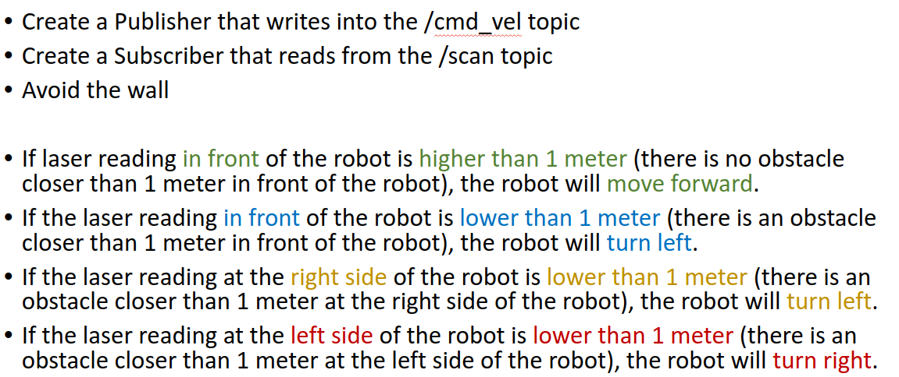
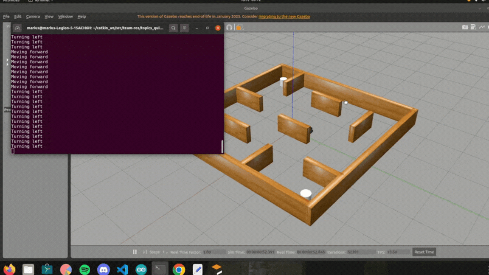
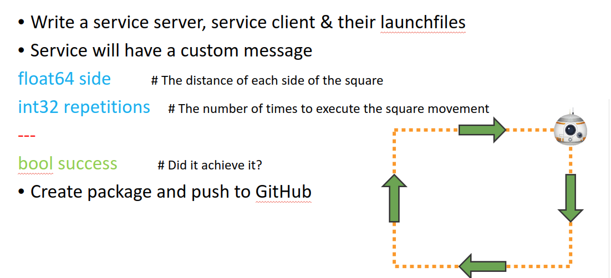
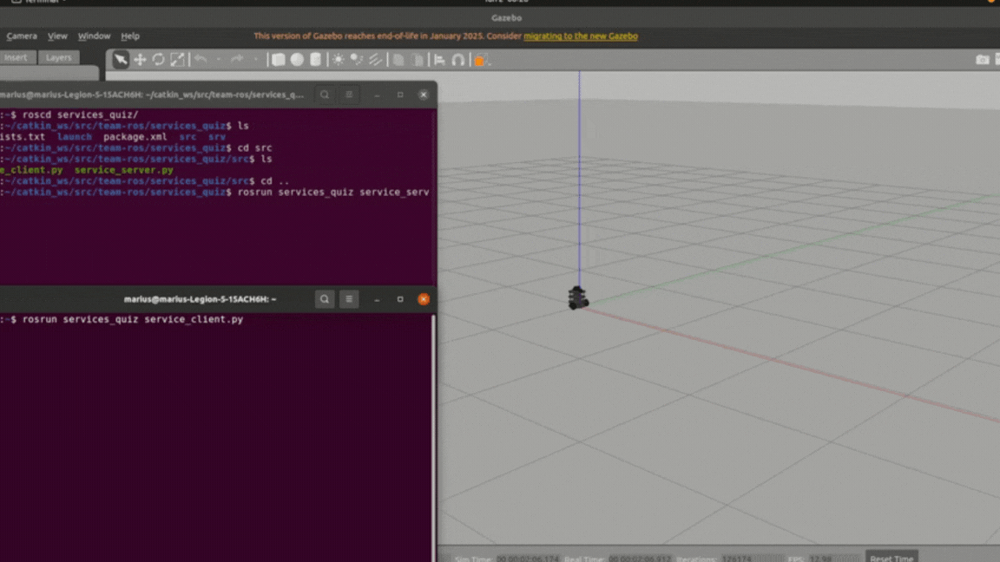
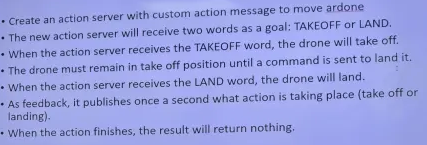
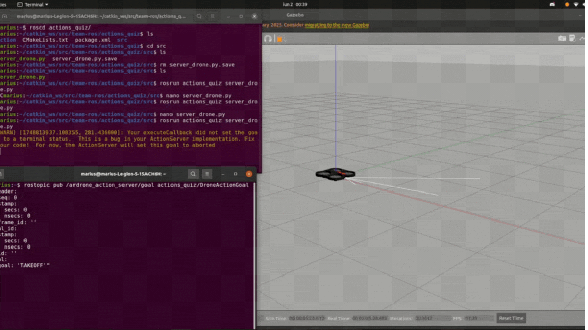

# ROS Nodes: Topics, Services & Actions

This repository contains three examples demonstrating how to create and use ROS communication mechanisms: **Topics**, **Services**, and **Actions**. Each section below includes:

1. **Request** – a description of what is required (shown as an embedded image).
2. **Result** – the expected output (shown as an embedded GIF).
3. A brief explanation of how the implementation works.

---

## 1. Topics

**Request**  

**Result**  

### Description

- **Publisher**: A node that publishes `geometry_msgs/Twist` messages to the `/cmd_vel` topic.
- **Subscriber**: A node that subscribes to `sensor_msgs/LaserScan` messages from the `/scan` topic.
- **Behavior**:
  - If the laser reading **in front** of the robot is **higher than 1 meter** (no obstacle within 1 m), the robot moves forward.
  - If the laser reading **in front** is **lower than 1 meter**, the robot turns left.
  - If the laser reading at the **right side** is **lower than 1 meter**, the robot turns left.
  - If the laser reading at the **left side** is **lower than 1 meter**, the robot turns right.

Refer to the code in `src/topics_node.py` for the full implementation.

---

## 2. Services

**Request**  

**Result**  

### Description

- **Custom Service**:  
  - **Request** fields:
    - `float64 side` – the length of each side of the square (in meters).
    - `int32 repetitions` – the number of times to execute the square movement.
  - **Response** fields:
    - `bool success` – whether the robot completed the square(s) successfully.
- **Service Server**: Listens for requests on a custom service (e.g., `/square_move`). When called, it commands the robot to move in a square of side length `side` meters, repeated `repetitions` times. Returns a boolean indicating success.
- **Service Client**: A separate node that sends a `SquareMove.srv` request (with `side` and `repetitions`) to the server and prints the returned `success` flag.
- **Launchfiles**:  
  - `launch/square_server.launch` – starts the service server.
  - `launch/square_client.launch` – starts the client and calls the service with preset arguments.

Refer to the files in `srv/SquareMove.srv`, `src/square_server.py`, and `src/square_client.py` for complete examples.

---

## 3. Actions

**Request**  

**Result**  

### Description

- **Custom Action**:  
  - **Goal** fields:
    - `string command` – either `TAKEOFF` or `LAND`.
  - **Feedback**:
    - `string status` – a message published once (e.g., “Taking off…” or “Landing…”).
  - **Result**:
    - _(Empty)_ – no result messages beyond feedback.
- **Action Server**:  
  - Advertises a “drone_control” action.
  - When it receives `TAKEOFF`, it commands the drone to take off and publishes a feedback message.
  - When it receives `LAND`, it commands the drone to land and publishes a feedback message.
- **Action Client**:  
  - Sends a goal with either `TAKEOFF` or `LAND` and waits for the action to complete.
  - Prints feedback messages as they arrive.

---

## Contact

If you have questions or feedback, feel free to reach out:

📧 mariusc0023@gmail.com

